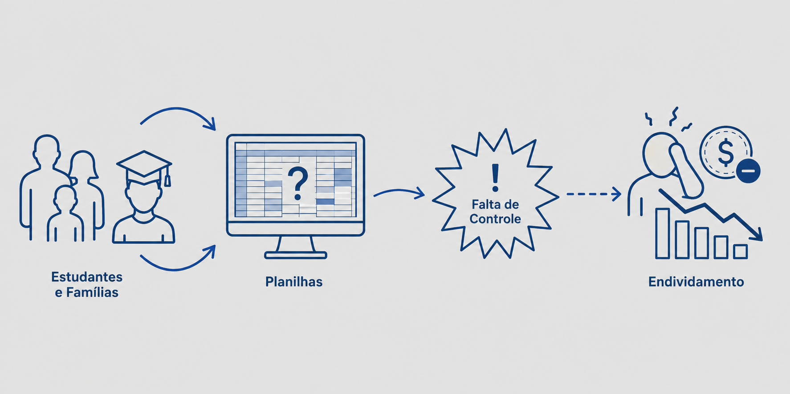
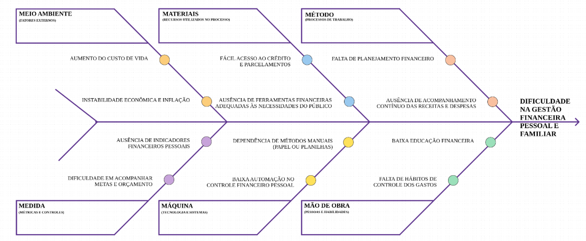
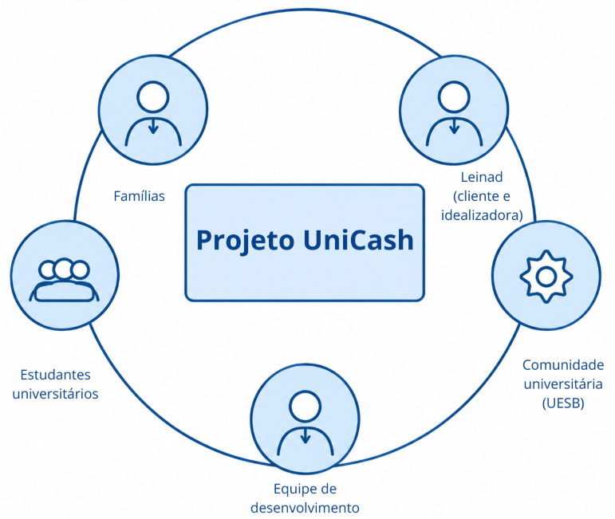

# 1 - Cenário atual do negócio e do cliente

## 1.1 Identificação do Cliente/Parceiro

**Nome:** Leinad Santos França.

**Tipo:** Pessoa física; representante do projeto.

**Representante:** Leinad Santos França.

**Forma de contato:** WhatsApp; reuniões periódicas por videoconferência.

**Vínculo com o projeto:** Cliente real e idealizadora.

## 1.2 Introdução ao Negócio e Contexto

A cliente é uma funcionária pública na Universidade Estadual da Bahia (UESB), atuando como técnica.

A ideia do projeto surgiu da necessidade de auxiliar famílias que enfrentam dificuldades na organização de suas finanças pessoais, especialmente no acompanhamento de receitas, despesas e orçamento doméstico.

Posteriormente, o escopo foi ampliado para atender estudantes universitários que recebem bolsa-auxílio, ajudando-os a gerir suas despesas diárias (como xerox, viagem e aluguel) e a construir uma reserva financeira.

## 1.3 Rich Picture

## 1.4 Identificação da Oportunidade ou Problema

O projeto surge dada a dificuldade crônica das pessoas em administrar e gerir recursos financeiros limitados. A ineficiência das ferramentas atuais, como o Excel, faz com que as pessoas percam o controle de seus gastos, resultando em acúmulo de dívidas ou, no caso dos estudantes, na falta de dinheiro para eventos importantes.

A figura a seguir apresenta o Diagrama de Ishikawa contendo as causas (organizadas pelos 6M) e o problema da UniCash.

## 1.5 Desafios do Projeto

A cliente não possuía conhecimento técnico ou oportunidades para o desenvolvimento da ideia, pois, por possuir poucas responsabilidades financeiras, não sentia dificuldade em administrar o dinheiro. Porém, acredita que a ideia do projeto possa impactar a vida de muitos estudantes, uma vez que consegue ver de perto a realidade no local onde trabalha, e de famílias que necessitam controlar os gastos para evitar endividamentos.

## 1.6 Identificação dos Stakeholders

| **Stakeholder** | **Relação com a solução** | **Interesse principal** | **Influência** |
|---|---|---|---|
| Leinad Santos França | Representante do cliente | Validar escopo, prioridades e entregas | Alta |
| Estudantes universitários | Usuários finais | Gerir despesas rotineiras e poupar para metas futuras | Alta |
| Famílias | Usuários finais | Organizar contas domésticas e evitar endividamento | Alta |
| Comunidade universitária (UESB) | Usuários secundários | Controlar finanças pessoais com simplicidade e sem custos | Média |
| Equipe de desenvolvimento | Responsável pela construção do produto | Entregar uma solução viável e de qualidade | Alta |

## 1.7 Segmentação de Clientes

Foram identificados os seguintes perfis de usuários:

- **Estudantes universitários:** Jovens que recebem bolsa da instituição, possuem gastos rotineiros específicos e desejam poupar para despesas futuras, como a formatura;
- **Famílias:** Pessoas que necessitam de maior organização no controle de contas fixas, gastos domésticos e despesas imprevistas do lar;
- **Comunidade universitária em geral:** Um público abrangente que engloba professores, técnicos e demais pessoas interessadas em organizar finanças.