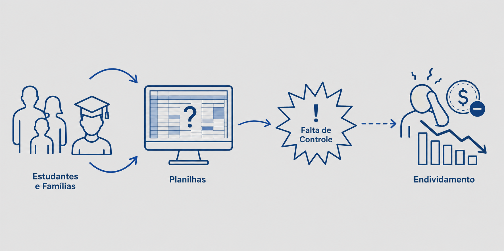
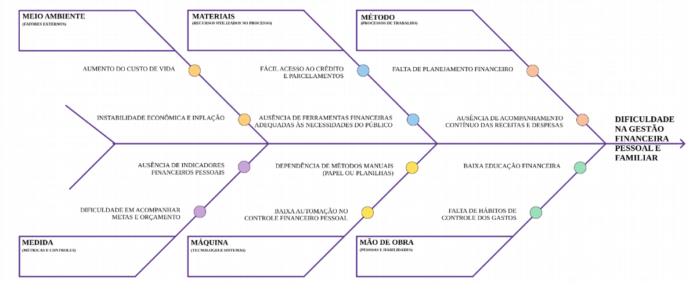
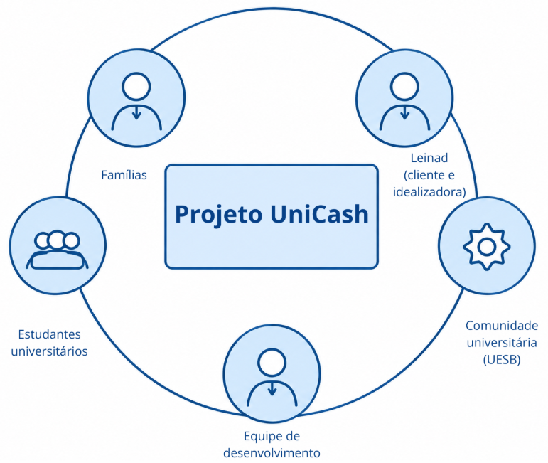

# 1 - Cenário atual do negócio e do cliente

## 1.1 Identificação do Cliente/Parceiro

**Nome:** Leinad Santos França.

**Tipo:** Pessoa física; idealizadora e patrocinadora conceitual do projeto.

**Representante:** Leinad Santos França, como idealizadora; Maria Vitória, como representante dos usários estudantes; Alana França, como representante dos usuários de famílias.

**Forma de contato:** WhatsApp; reuniões periódicas por videoconferência.

**Vínculo com o projeto:** Cliente real e idealizadora do produto e responsável pela articulação inicial do projeto.

## 1.2 Introdução ao Negócio e Contexto

A cliente é uma funcionária pública na Universidade Estadual da Bahia (UESB), atuando como técnica.

A ideia do projeto surgiu da necessidade de auxiliar pessoas que enfrentam dificuldades na organização de suas finanças pessoais, especialmente no acompanhamento de receitas, despesas e orçamento doméstico. Leinad Santos França atua como idealizadora, enquanto Maria Vitória representa os estudantes e Alana França representa as famílias durante o levantamento e a validação das necessidades.

Posteriormente, o escopo foi ampliado para atender estudantes universitários que recebem bolsa-auxílio, ajudando-os a gerir suas despesas diárias (como xerox, viagem e aluguel) e a construir uma reserva financeira.

## 1.3 Rich Picture

## 1.4 Identificação da Oportunidade ou Problema

O projeto surge a partir da dificuldade de pessoas que não possuem educação financeira suficiente para organizar e acompanhar suas finanças pessoais. Entre as dificuldades a serem investigadas estão a falta de hábito de registrar receitas e despesas, a dificuldade de compreender a própria situação financeira e de planejar o uso de recursos limitados. Essas dificuldades podem contribuir para a perda de controle dos gastos, para o endividamento e, no caso dos estudantes, para a falta de dinheiro para compromissos importantes. 

A figura a seguir apresenta o Diagrama de Ishikawa contendo as causas (organizadas pelos 6M) e o problema da UniCash.

## 1.5 Desafios do Projeto

Os principais desafios do projeto são produzir mudança comportamental, incentivando o registro contínuo e o planejamento financeiro, e conquistar a confiança dos usuários para que registrem informações financeiras pessoais. Também será necessário validar as necessidades com representantes dos segmentos atendidos, garantindo que a solução não seja definida apenas pela perspectiva da idealizadora.

## 1.6 Identificação dos Stakeholders

| **Stakeholder** | **Relação com a solução** | **Interesse principal** | **Influência** | **Impacto** | **Participação na ER** |
|---|---|---|---|---|---|
| Leinad Santos França | Idealizadora e patrocinadora conceitual | Definir a visão inicial e acompanhar o projeto | Média | Médio | Alta |
| Maria Vitória | Representante dos estudantes e participante da ER | Representar necessidades, dificuldades e expectativas dos estudantes | Alta | Médio/Alto| Alta
| Alana França | Representante das famílias e participante da ER | Representar necessidades, dificuldades e expectativas das famílias | Alta | Médio/Alto | Alta
| Estudantes universitários | Usuários finais e público potencial | Gerir despesas rotineiras e poupar para metas futuras | Média | Alto | Baixa |
| Famílias | Usuários finais e público potencial | Organizar contas domésticas e evitar o endividamento | Média | Alto | Baixa |
| Pessoas com dificuldade de controle financeiro | Público potencial de mercado | Encontrar formas simples de registrar, compreender e planejar suas finanças | Média | Alto | Baixa
| Equipe de desenvolvimento | Responsável pela construção do produto | Transformar necessidades validadas em uma solução viável e de qualidade | Alta | Médio | Alta |

## 1.7 Segmentação de Clientes

Foram identificados os seguintes perfis de usuários:

- **Estudantes universitários:** Jovens que recebem bolsa da instituição, possuem gastos rotineiros específicos e desejam poupar para despesas futuras, como a formatura;
- **Famílias:** Pessoas que necessitam de maior organização no controle de contas fixas, gastos domésticos e despesas imprevistas do lar;
- **Comunidade universitária em geral:** Um público abrangente que engloba professores, técnicos e demais pessoas interessadas em organizar finanças.
- **Pessoas com dificuldade de controle financeiro:** Público potencial de mercado que inclui pessoas com dificuldade de organizar receitas e despesas, manter o hábito de registro ou planejar o uso do próprio dinheiro.