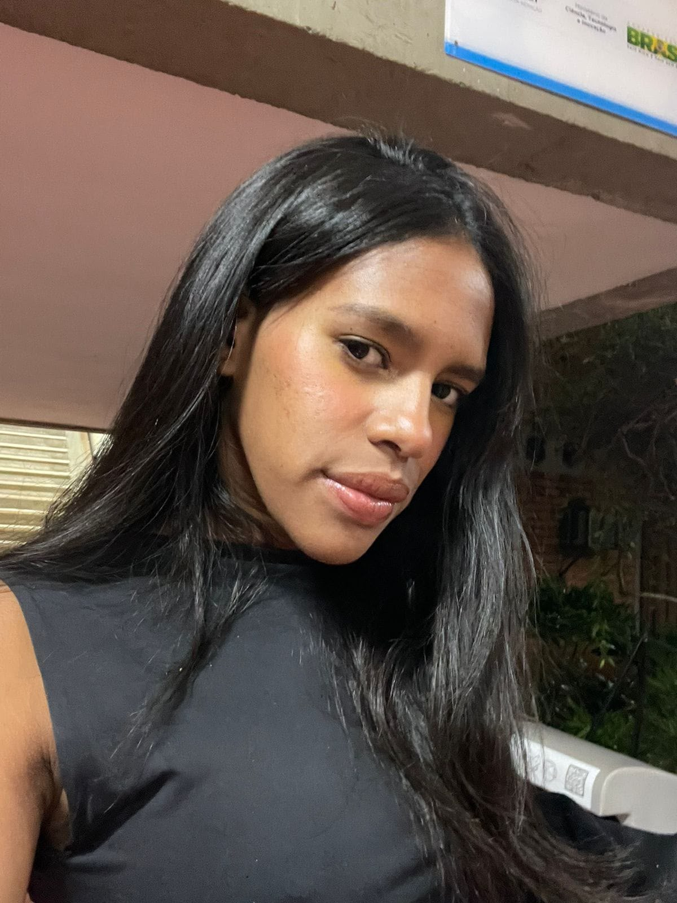

# UniCash

## Organize hoje. Planeje o amanhã.

O **UniCash** é uma proposta de plataforma de gestão financeira pessoal criada para ajudar estudantes universitários, famílias e demais membros da comunidade a organizar melhor suas finanças.

A ideia surgiu a partir da dificuldade de acompanhar receitas, despesas e compromissos financeiros usando planilhas ou anotações dispersas. Quando essas informações não estão organizadas, torna-se mais difícil controlar os gastos, evitar dívidas e planejar despesas futuras.

## Nossa proposta

O UniCash reunirá, em um único lugar, recursos para:

- registrar e acompanhar receitas e despesas;
- categorizar os gastos e identificar hábitos de consumo;
- acompanhar o orçamento e o saldo disponível;
- criar metas financeiras e estimular a formação de reservas;
- visualizar relatórios e indicadores para apoiar decisões mais conscientes.

A plataforma será planejada para oferecer uma experiência simples, intuitiva e acessível, inclusive para pessoas sem conhecimento prévio em educação financeira.

## Para quem é o UniCash?

- **Estudantes universitários:** para administrar bolsa-auxílio e despesas como transporte, alimentação, aluguel e materiais acadêmicos;
- **Famílias:** para organizar contas domésticas, gastos fixos e despesas imprevistas;
- **Comunidade universitária:** para qualquer pessoa interessada em controlar seus recursos e desenvolver hábitos financeiros mais saudáveis.

## Objetivo do projeto

O objetivo do UniCash é contribuir para uma relação mais consciente com o dinheiro. Ao facilitar o registro e a visualização das movimentações financeiras, a solução pretende ampliar a autonomia dos usuários, apoiar o planejamento e reduzir situações de desorganização financeira e endividamento.

## Equipe SevenSpecs

	

		
		<strong>Natan França</strong>
	

	

		
		<strong>Dante Scarpati</strong>
	

	

		
		<strong>Erick Alves</strong>
	

	

		
		<strong>Leonardo Alves</strong>
	

	

		
		<strong>Evellyn Rocha</strong>
	

	

		BD
		<strong>Bruno Duarte</strong>
	

	

		CP
		<strong>Caio Pacheco</strong>
	

## Como o projeto será desenvolvido

A evolução da solução será orientada por protótipos, validações frequentes com a cliente e feedback dos usuários. O projeto adota o DSDM como processo de engenharia de software e o Kanban como apoio à organização das atividades.

## Vídeo de apresentação da visão do produto Unicash
<iframe width="560" height="315" src="https://www.youtube.com/embed/3qLZkL-_ePc?si=JLmmAyHCotTmptjv" title="YouTube video player" frameborder="0" allow="accelerometer; autoplay; clipboard-write; encrypted-media; gyroscope; picture-in-picture; web-share" referrerpolicy="strict-origin-when-cross-origin" allowfullscreen></iframe>

## Slides utilizados no vídeo

	<iframe loading="lazy" style="position: absolute; width: 100%; height: 100%; top: 0; left: 0; border: none; padding: 0;margin: 0;"
		src="https://www.canva.com/design/DAHUiGBCPsM/MeSY-YY2hkqsaqhigXwIyA/view?embed" allowfullscreen="allowfullscreen" allow="fullscreen">
	</iframe>

<a href="https:&#x2F;&#x2F;www.canva.com&#x2F;design&#x2F;DAHUiGBCPsM&#x2F;MeSY-YY2hkqsaqhigXwIyA&#x2F;view?utm_content=DAHUiGBCPsM&amp;utm_campaign=designshare&amp;utm_medium=embeds&amp;utm_source=link" target="_blank" rel="noopener">

## Conheça o projeto

- [Cenário atual do negócio e do cliente](cenario.md)
- [Solução proposta](solucao.md)
- [Intervenção social](intervencao.md)
- [Estratégias de engenharia de software](estrategia.md)
- [Cronograma e entregas](cronograma.md)
- [Interação entre equipe e cliente](interacao.md)
